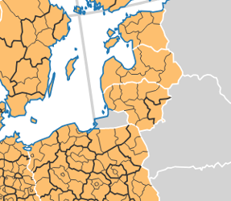
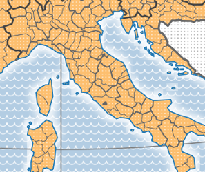
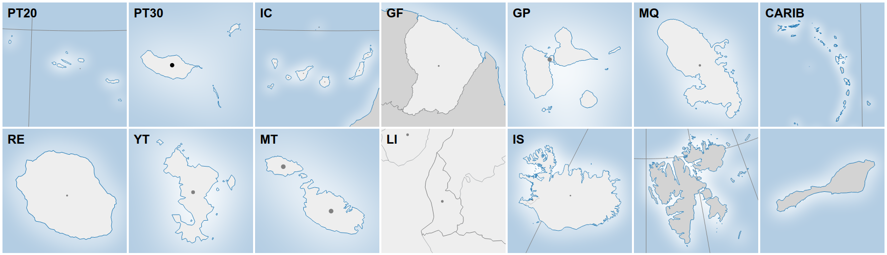

# Nuts2json

[Nuts2json](https://github.com/eurostat/Nuts2json) provides the [Eurostat NUTS geometries](http://ec.europa.eu/eurostat/web/nuts/overview) as web formats such as [TopoJSON](https://github.com/mbostock/topojson/wiki) and [GeoJSON](http://geojson.org/). It is provided to support the development of statistical web maps of [Eurostat data](http://ec.europa.eu/eurostat/) based on NUTS regions. In a way, it provides a blank map of geometries ready for use with your own data and cartographic style.

See [some examples below](https://github.com/eurostat/Nuts2json#some-examples).

For a faster creation of maps based on Nuts2json, check out [**eurostat-map.js**](https://github.com/eurostat/eurostat-map.js).

For a faster creation of [Dorling cartograms](http://www.dannydorling.org/wp-content/files/dannydorling_publication_id1448.pdf) based on Nuts2json, check out [**NutsDorlingCartogram**](https://github.com/eurostat/NutsDorlingCartogram).

## API

Base URL: `https://raw.githubusercontent.com/eurostat/Nuts2json/master/pub/v2`
(See [here](#own-deployment) how to define your own base URL)

URL patterns:

- For TopoJSON format: `/<YEAR>/<PROJECTION>/<SCALE>/<NUTS_LEVEL>.json`
- For GeoJSON format: `/<YEAR>/<PROJECTION>/<SCALE>/<TYPE>[_<NUTS_LEVEL>].json`

For example, [`https://raw.githubusercontent.com/eurostat/Nuts2json/master/pub/v2/2016/3035/20M/2.json`](https://raw.githubusercontent.com/eurostat/Nuts2json/master/pub/v2/2016/3035/20M/2.json) returns a TopoJSON file of 2016 NUTS regions level 2 in European LAEA projection ([EPSG 3035](http://spatialreference.org/ref/epsg/etrs89-etrs-laea/)) for 1:20M scale.

The parameters are:

| Parameter | Supported values | Description |
| ------------- | ------------- |-------------|
| `YEAR` | `2021` `2016` `2013` `2010` | The NUTS version. |
| `PROJECTION` | `3035` `3857` `4326` | The coordinate reference system EPSG code. Two projections are provided: European LAEA projection ([EPSG 3035](http://spatialreference.org/ref/epsg/etrs89-etrs-laea/)) and web mercator ([EPSG 3857](http://spatialreference.org/ref/sr-org/7483/)). For statistical maps, it is strongly adviced to use an equal-area projection such as `3035`. Geographic coordinates WGS84 ([EPSG 4326](http://spatialreference.org/ref/epsg/4326/)) are also provided. |
| `SCALE` | `60M` `20M` `10M` `03M` | The intended map scale factor. The larger the value, the stronger the simplification. For example, for a map width of 1000 pixels, the scale 1:20M is the most suitable. |
| `NUTS_LEVEL` | `0` `1` `2` `3` | The NUTS level to display, from national (NUTS_LEVEL=`0`) to local level (NUTS_LEVEL=`3`). |
| `TYPE` | `nutsrg` `nutsbn` `cntrg` `cntbn` `gra` | For GeoJSON format, the feature type has to be specified. The available feature types are described below. For NUTS feature types (`nutsrg` and `nutsbn`), the `NUTS_LEVEL` to be displayed on the map has to be specified.  |

For additional projections, formats, scales, etc., feel free to [ask](https://github.com/eurostat/Nuts2json/issues/new) !

### Feature types

The following feature types are provided:

- NUTS regions (feature type `nutsrg`) with the following properties:
  - `id`: The NUTS identifier to be used to join Eurostat statistical figures and then assign colors to the regions.
  - `na`: The latin geographical name of the region.

- NUTS boundaries (feature type `nutsbn`) with the following properties:
  - `id`: An identifier.
  - `lvl`: The NUTS level of the boundary, from 0 (national level) to 3 (provincial level).
  - `eu`: T if the boundary separate two EU member states, F otherwise.
  - `efta`: T if the boundary touches at least one EFTA country, F otherwise.
  - `cc`: T if the boundary touches at least one Candidate Country, F otherwise.
  - `oth`: T if the boundary touches at least one country which is not EU, EFTA,CC. F otherwise.
  - `co`: T if the boundary is coastal. F otherwise.

- Countries (feature type `cntrg`) with the following properties:
  - `id`: The country identifier (2 letters ISO-code).
  - `na`: The latin country name.

- Country boundaries (feature type `cntbn`) with the following properties:
  - `id`: An identifier.
  - `eu`: T if the boundary separate two EU member states, F otherwise.
  - `efta`: T if the boundary touches at least one EFTA country, F otherwise.
  - `cc`: T if the boundary touches at least one Candidate Country, F otherwise.
  - `oth`: T if the boundary touches at least one country wich is not EU, EFTA,CC. F otherwise.
  - `co`: T if the boundary is coastal. F otherwise.

- The map graticule (meridian and parrallel lines) is provided as feature type `gra` with a single `id` property, which is the lat/lon of the parallel/meridian.

### NUTS regions as points

NUTS regions are also provided as point geometries. These points can be used for label placement or simplified maps such as [Dorling cartograms](http://www.dannydorling.org/wp-content/files/dannydorling_publication_id1448.pdf). Since this data does not depend on the `<SCALE>` parameter, it can be retrieved directly under the `/<YEAR>/<PROJECTION>/nutspt_<NUTS_LEVEL>.json` URL pattern, as GeoJSON format.

For example, [`https://raw.githubusercontent.com/eurostat/Nuts2json/master/pub/v2/2013/4326/nutspt_2.json`](https://raw.githubusercontent.com/eurostat/Nuts2json/master/pub/v2/2013/4326/nutspt_2.json) returns a GeoJSON file of 2013 NUTS points level 2 in WGS84 ([EPSG 4326](http://spatialreference.org/ref/epsg/etrs89-etrs-laea/)) geographic coordinates.

The point features are provided with the following properties:
  - `id`: The NUTS identifier.
  - `na`: The latin geographical name of the region.
  - `ar`: The area of the region, in m².

### Overseas territories - map insets

To add [map insets](http://wiki.gis.com/wiki/index.php/Inset_Map) showing overseas territories or detail on small countries, dedicated files can be used. To access these files, the URL patterns are the same as the ones previously defined, except an additional **GEO** parameter has to be specified here: 
`.../<YEAR>/<GEO>/<PROJECTION>/...`. This parameter specifies the territory of interest. For example, [`https://raw.githubusercontent.com/eurostat/Nuts2json/master/pub/v2/2021/GF/32622/10M/1.json`](https://raw.githubusercontent.com/eurostat/Nuts2json/master/pub/v2/2021/GF/32622/10M/1.json) returns a TopoJSON file of 2021 NUTS regions level 1 on French Guiana overseas territory in UTM zone 22N projection at 1:10M scale.

The values supported for this additional **GEO** parameter are listed in the table below. For each of them, a specific projection is proposed, replacing the European LAEA projection when necessary. For all of them, an additional value for the `SCALE` parameter is available, `01M`, corresponding to the 1:1M scale. The scale `60M`, too coarse for these small territories, is not provided.

| **GEO** | Territory | Specific projection |
| ------------- | ------------- | ------------- |
| `PT20` | Azores | `32626` - [UTM zone 26N](https://spatialreference.org/ref/epsg/wgs-84-utm-zone-26n/) |
| `PT30` | Madeira | `32628` - [UTM zone 28N](https://spatialreference.org/ref/epsg/wgs-84-utm-zone-28n/) |
| `IC` | Canary islands | `32628` - [UTM zone 28N](https://spatialreference.org/ref/epsg/wgs-84-utm-zone-28n/) |
| `GF` | French Guiana | `32622` - [UTM zone 22N](https://spatialreference.org/ref/epsg/wgs-84-utm-zone-22n/) |
| `GP` | Guadeloupe | `32620` - [UTM zone 20N](https://spatialreference.org/ref/epsg/wgs-84-utm-zone-20n/) |
| `MQ` | Martinique | `32620` - [UTM zone 20N](https://spatialreference.org/ref/epsg/wgs-84-utm-zone-20n/) |
| `CARIB` | Caribbean islands | `32620` - [UTM zone 20N](https://spatialreference.org/ref/epsg/wgs-84-utm-zone-20n/) |
| `RE` | Réunion | `32740` - [UTM zone 40S](https://spatialreference.org/ref/epsg/wgs-84-utm-zone-40s/) |
| `YT` | Mayotte | `32738` - [UTM zone 38S](https://spatialreference.org/ref/epsg/wgs-84-utm-zone-38s/) |
| `MT` | Malta | `3035` - [European LAEA projection](http://spatialreference.org/ref/epsg/etrs89-etrs-laea/) |
| `LI` | Liechtenstein | `3035` - [European LAEA projection](http://spatialreference.org/ref/epsg/etrs89-etrs-laea/) |
| `IS` | Iceland | `3035` - [European LAEA projection](http://spatialreference.org/ref/epsg/etrs89-etrs-laea/) |
| `SJ_SV` | Svalbard | `3035` - [European LAEA projection](http://spatialreference.org/ref/epsg/etrs89-etrs-laea/) |
| `SJ_JM` | Jan Mayen | `3035` - [European LAEA projection](http://spatialreference.org/ref/epsg/etrs89-etrs-laea/) |

For additional territories, feel free to [ask](https://github.com/eurostat/Nuts2json/issues/new) !

## Some examples

These examples are based on [d3js](https://d3js.org/) library.

- [Basic example](https://bl.ocks.org/jgaffuri/raw/e7e0a76a6e0f851b253d3b1c8fb17ffb/) (see the [code](https://bl.ocks.org/jgaffuri/e7e0a76a6e0f851b253d3b1c8fb17ffb)).
- [Advanced example](https://bl.ocks.org/jgaffuri/raw/71d130bf5963c5ffe0a436399f401af3/) (see the [code](https://bl.ocks.org/jgaffuri/71d130bf5963c5ffe0a436399f401af3)).
- [Statistical map examples](https://github.com/eurostat/eurostat-map.js#examples) based on [eurostat-map.js](https://github.com/eurostat/eurostat-map.js).
- [NUTS regions as points](https://observablehq.com/@jgaffuri/nuts-regions-as-points).
- [NUTS regions Dorling cartogram](https://observablehq.com/@jgaffuri/dorling-cartogram).
- [NUTS population Dorling cartogram](https://observablehq.com/@jgaffuri/dorling-cartogram-population).
- [NUTS population change Dorling cartogram](https://observablehq.com/@jgaffuri/dorling-cartogram-population-change).
- [NUTS Dorling cartogram](https://github.com/eurostat/NutsDorlingCartogram).

## Own deployment

To deploy your own stable version of Nuts2json, `git clone` the repository and simply publish the `pub` folder on your own web server folder accessible under the URL of your choice. Use the new base URL, for example `https://www.mydomain.eu/path/to/pub/v2`, to access the service. This offers the possibility to select only the necessary API elements of interest.

## Technical details

These files are produced from the NUTS geodata provided on [Eurostat-GISCO website](http://ec.europa.eu/eurostat/web/gisco/geodata/reference-data/administrative-units-statistical-units/nuts). The entire process is automated in a [Python](https://www.python.org/) script, which is available in the [/src/py/ folder](/src/py/). This process has the following steps:
1. *download*: Retrieve the input data from [Eurostat GISCO API](https://gisco-services.ec.europa.eu/distribution/) and stored it in a *download* folder.
2. *filterRenameDecomposeClean*: Prepare input data: filter, rename attributes, decompose by NUTS level and clean some invalid geometries.
3. *coarseClipping*: Apply a coarse data selection with clipping on the areas of interest.
4. *reprojectClipGeojson*: Reproject, clip more precisely and convert as GeoJSON.
5. *topoGeojson*: Make TopoJSON file from GeoJSON files, simplify them with [TopoJSON Simplify](https://github.com/topojson/topojson-simplify/) program, and finally produce simplified GeoJSON from TopoJSON.
6. *points*: Produce point representations.

Information on the NUTS versions to cover, the scales, projections, map insets and their extents, etc. is stored in the [param.json](/src/py/param.json) file.

The software needed to run this process are the following:
- [Python](https://www.python.org/), version 3.8.2 (or higher)
- [TopoJSON](https://github.com/mbostock/topojson/wiki), version 2.0

## About

| | |
|-|-|
| *contributors* |    |
| *version* | 1 |
| *status* | Since 2016 |
| *license* | [EUPL 1.2](https://github.com/eurostat/Nuts2json/blob/master/LICENSE) |

## Support and contribution

Feel free to [ask support](https://github.com/eurostat/Nuts2json/issues/new), fork the project or simply star it (it's always a pleasure).

## Copyright

The [Eurostat NUTS dataset](http://ec.europa.eu/eurostat/web/nuts/overview) is copyrighted. There are [specific provisions](https://ec.europa.eu/eurostat/web/gisco/geodata/reference-data/administrative-units-statistical-units) for the usage of this dataset which must be respected. The usage of these data is subject to their acceptance. See the [Eurostat-GISCO website](http://ec.europa.eu/eurostat/web/gisco/geodata/reference-data/administrative-units-statistical-units/nuts) for more information.

## Disclaimer

The designations employed and the presentation of material on these maps do not imply the expression of any opinion whatsoever on the part of the European Union concerning the legal status of any country, territory, city or area or of its authorities, or concerning the delimitation of its frontiers or boundaries. Kosovo*: This designation is without prejudice to positions on status, and is in line with UNSCR 1244/1999 and the ICJ Opinion on the Kosovo declaration of independence. Palestine*: This designation shall not be construed as recognition of a State of Palestine and is without prejudice to the individual positions of the Member States on this issue.
